# Weather Service Design Document

## 1. Overview & Context

### Problem Statement
We need a Weather Web API service that provides current weather information to clients. The service aggregates data from multiple sensor services (Temperature, Wind, Precipitation) to provide a unified weather API.

### Background
- The Weather service acts as an aggregator/facade for underlying sensor services
- Sensor services are external dependencies that will be mocked using [Mockery](https://github.com/busadave13/Mockery) during development and testing
- This design follows clean architecture principles with clear separation between HTTP handling and business logic

### Scope
- **In Scope**: Weather API implementation, business logic layer, sensor client interfaces, Mockery integration
- **Out of Scope**: Actual sensor hardware/services, authentication, data persistence

### Target Audience
- Developers implementing the Weather service
- Teams consuming the Weather API

---

## 2. Goals & Non-Goals

### Goals
- Provide 4 REST API endpoints for weather data retrieval
- Clean separation between controllers and business logic
- Support dependency injection for all components
- Enable easy unit testing through interface-based design
- Integrate with Mockery for sensor service mocking

### Non-Goals
- Building actual sensor services
- Implementing authentication/authorization
- Data caching or persistence
- Historical weather data

---

## 3. Requirements

### Functional Requirements

| ID | Requirement | Priority |
|----|-------------|----------|
| FR-1 | `GET api/weather` returns combined weather data (temperature, wind, precipitation) | High |
| FR-2 | `GET api/weather/temperature` returns current temperature data | High |
| FR-3 | `GET api/weather/wind` returns current wind conditions | High |
| FR-4 | `GET api/weather/precipitation` returns current precipitation data | High |
| FR-5 | All endpoints return JSON responses | High |
| FR-6 | Service calls external sensor services for data | High |

### Non-Functional Requirements

| ID | Requirement | Target |
|----|-------------|--------|
| NFR-1 | Response time for individual sensor endpoints | < 500ms |
| NFR-2 | Response time for combined weather endpoint | < 1500ms |
| NFR-3 | Unit test coverage for business logic | > 80% |
| NFR-4 | All dependencies injectable via DI | Required |

---

## 4. Architecture

### High-Level Architecture

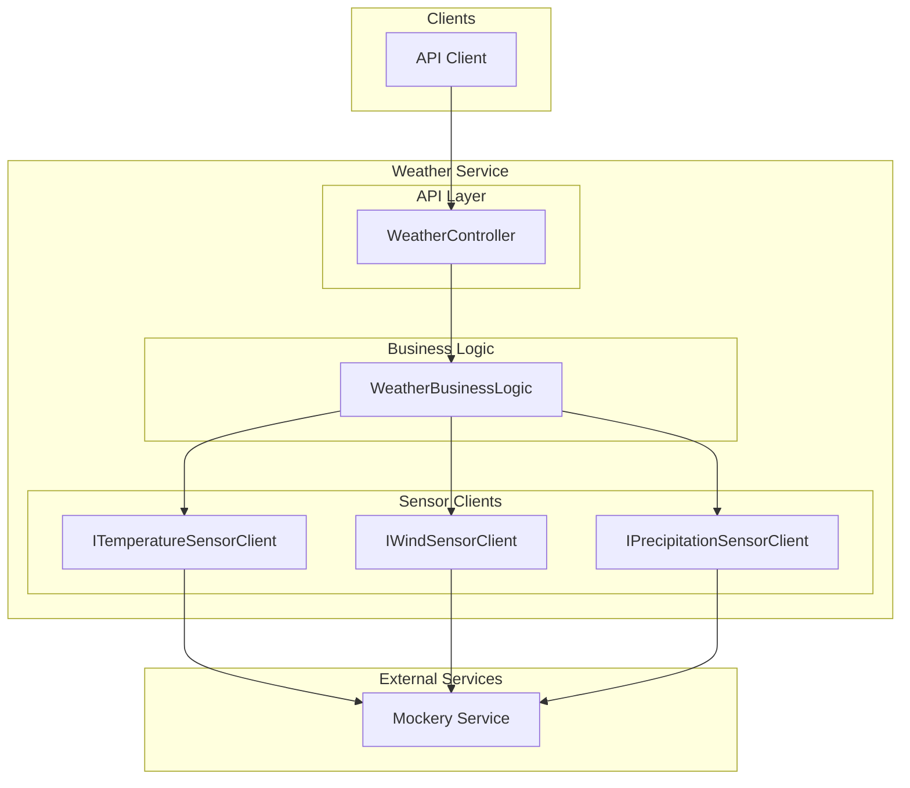

### Design Principles

1. **Controllers**: Handle HTTP concerns only (request parsing, response formatting)
2. **Business Logic**: Pure C# classes with no HTTP context dependencies
3. **Sensor Clients**: HTTP clients that call Mockery service
4. **Dependency Injection**: All dependencies registered in DI container

---

## 5. Component Design

### Model Separation Strategy

The Weather service maintains **two separate model namespaces** to ensure clean boundaries between external sensor data and the public API:

1. **Sensor Models** (`Clients/Models/`): Internal models representing raw sensor API responses
2. **Weather Models** (`Models/`): Public API models exposed by the Weather service

> **Important**: Sensor models are never exposed directly to API consumers. All mapping occurs in the Business Logic layer.

### Weather API Models (Public)

Located in `Models/` - these are the models returned by Weather API endpoints:

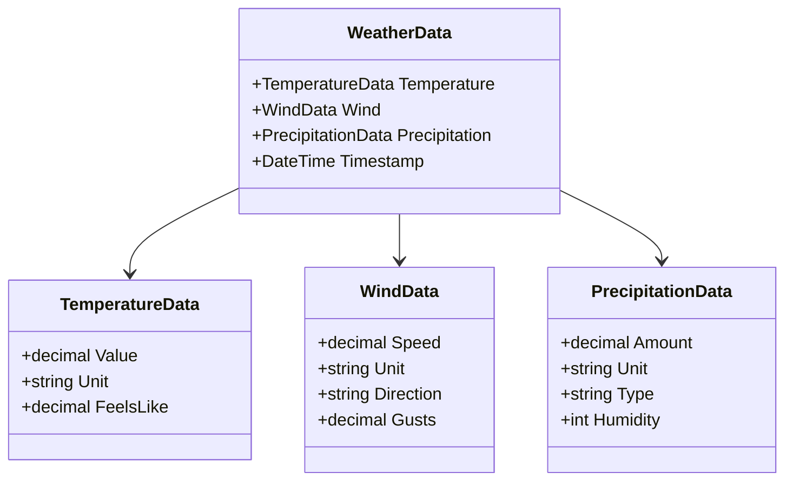

### Sensor Models (Internal)

Located in `Clients/Models/` - these represent raw responses from sensor services:

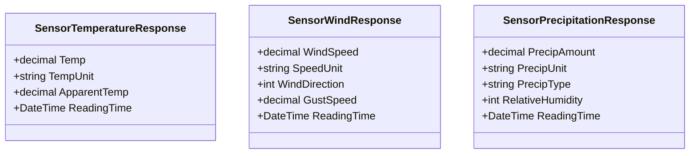

### Model Mapping Flow

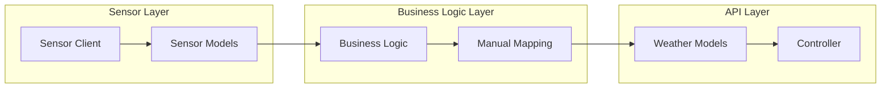

### Business Logic with Mapping

Business Logic classes are responsible for:
1. Calling sensor clients to retrieve sensor data
2. Mapping sensor models to Weather models (manual mapping, no AutoMapper)
3. Returning Weather models to controllers

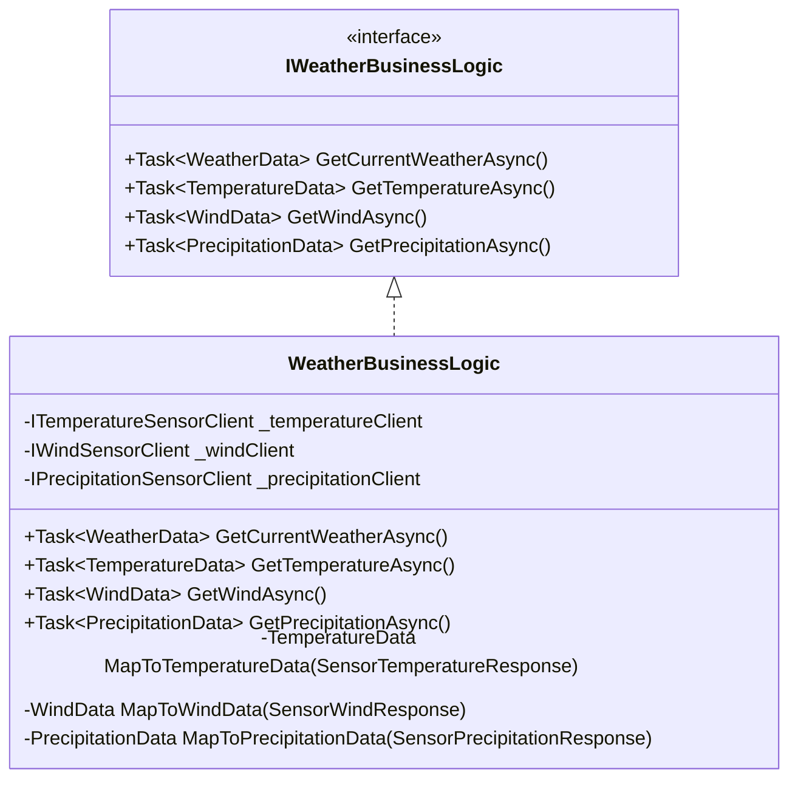

### Manual Mapping Implementation

**No AutoMapper** - all mapping is done manually with static mapping methods:

```csharp
public class TemperatureBusinessLogic : ITemperatureBusinessLogic
{
    private readonly ITemperatureSensorClient _sensorClient;

    public TemperatureBusinessLogic(ITemperatureSensorClient sensorClient)
    {
        _sensorClient = sensorClient;
    }

    public async Task<TemperatureData> GetCurrentTemperatureAsync()
    {
        // Get sensor model from client
        var sensorData = await _sensorClient.GetTemperatureAsync();
        
        // Map to Weather model
        return MapToTemperatureData(sensorData);
    }

    private static TemperatureData MapToTemperatureData(SensorTemperatureResponse source)
    {
        return new TemperatureData
        {
            Value = source.Temp,
            Unit = source.TempUnit,
            FeelsLike = source.ApparentTemp
        };
    }
}

public class WindBusinessLogic : IWindBusinessLogic
{
    private readonly IWindSensorClient _sensorClient;

    public WindBusinessLogic(IWindSensorClient sensorClient)
    {
        _sensorClient = sensorClient;
    }

    public async Task<WindData> GetCurrentWindAsync()
    {
        var sensorData = await _sensorClient.GetWindAsync();
        return MapToWindData(sensorData);
    }

    private static WindData MapToWindData(SensorWindResponse source)
    {
        return new WindData
        {
            Speed = source.WindSpeed,
            Unit = source.SpeedUnit,
            Direction = ConvertDegreesToCardinal(source.WindDirection),
            Gusts = source.GustSpeed
        };
    }

    private static string ConvertDegreesToCardinal(int degrees)
    {
        string[] cardinals = { "N", "NE", "E", "SE", "S", "SW", "W", "NW" };
        int index = (int)Math.Round(degrees / 45.0) % 8;
        return cardinals[index];
    }
}

public class PrecipitationBusinessLogic : IPrecipitationBusinessLogic
{
    private readonly IPrecipitationSensorClient _sensorClient;

    public PrecipitationBusinessLogic(IPrecipitationSensorClient sensorClient)
    {
        _sensorClient = sensorClient;
    }

    public async Task<PrecipitationData> GetCurrentPrecipitationAsync()
    {
        var sensorData = await _sensorClient.GetPrecipitationAsync();
        return MapToPrecipitationData(sensorData);
    }

    private static PrecipitationData MapToPrecipitationData(SensorPrecipitationResponse source)
    {
        return new PrecipitationData
        {
            Amount = source.PrecipAmount,
            Unit = source.PrecipUnit,
            Type = source.PrecipType,
            Humidity = source.RelativeHumidity
        };
    }
}

public class WeatherBusinessLogic : IWeatherBusinessLogic
{
    private readonly ITemperatureSensorClient _temperatureClient;
    private readonly IWindSensorClient _windClient;
    private readonly IPrecipitationSensorClient _precipitationClient;

    public WeatherBusinessLogic(
        ITemperatureSensorClient temperatureClient,
        IWindSensorClient windClient,
        IPrecipitationSensorClient precipitationClient)
    {
        _temperatureClient = temperatureClient;
        _windClient = windClient;
        _precipitationClient = precipitationClient;
    }

    public async Task<WeatherData> GetCurrentWeatherAsync()
    {
        // Parallel calls to all sensors
        var tempTask = _temperatureClient.GetTemperatureAsync();
        var windTask = _windClient.GetWindAsync();
        var precipTask = _precipitationClient.GetPrecipitationAsync();

        await Task.WhenAll(tempTask, windTask, precipTask);

        // Map all sensor responses to Weather models
        return new WeatherData
        {
            Temperature = MapToTemperatureData(await tempTask),
            Wind = MapToWindData(await windTask),
            Precipitation = MapToPrecipitationData(await precipTask),
            Timestamp = DateTime.UtcNow
        };
    }

    private static TemperatureData MapToTemperatureData(SensorTemperatureResponse source)
    {
        return new TemperatureData
        {
            Value = source.Temp,
            Unit = source.TempUnit,
            FeelsLike = source.ApparentTemp
        };
    }

    private static WindData MapToWindData(SensorWindResponse source)
    {
        string[] cardinals = { "N", "NE", "E", "SE", "S", "SW", "W", "NW" };
        int index = (int)Math.Round(source.WindDirection / 45.0) % 8;
        
        return new WindData
        {
            Speed = source.WindSpeed,
            Unit = source.SpeedUnit,
            Direction = cardinals[index],
            Gusts = source.GustSpeed
        };
    }

    private static PrecipitationData MapToPrecipitationData(SensorPrecipitationResponse source)
    {
        return new PrecipitationData
        {
            Amount = source.PrecipAmount,
            Unit = source.PrecipUnit,
            Type = source.PrecipType,
            Humidity = source.RelativeHumidity
        };
    }
}
```

### Sensor Client Interfaces

Sensor clients return **sensor models**, not Weather models:

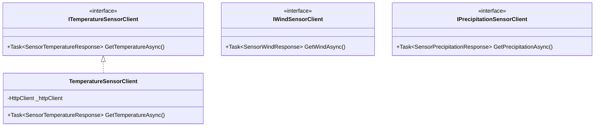

---

## 6. Data Flow

### Combined Weather Request Flow (with Model Mapping)

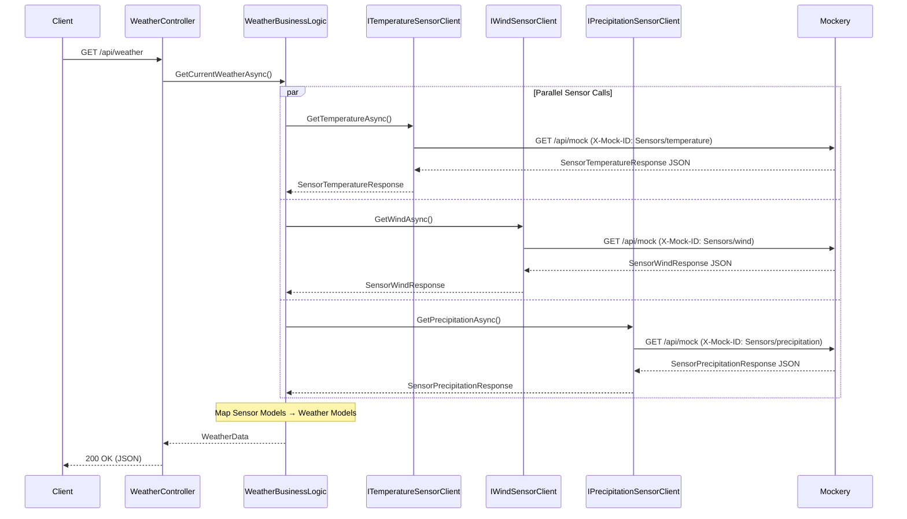

### Single Sensor Request Flow (with Model Mapping)

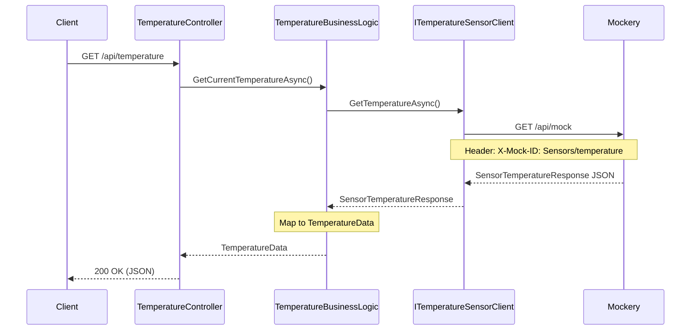

---

## 7. API Contracts

### GET /api/weather

**Response (200 OK):**
```json
{
    "temperature": {
        "value": 72.5,
        "unit": "F",
        "feelsLike": 74.0
    },
    "wind": {
        "speed": 12.3,
        "unit": "mph",
        "direction": "NW",
        "gusts": 18.5
    },
    "precipitation": {
        "amount": 0.0,
        "unit": "in",
        "type": "none",
        "humidity": 45
    },
    "timestamp": "2025-12-14T15:30:00Z"
}
```

### GET /api/weather/temperature

**Response (200 OK):**
```json
{
    "value": 72.5,
    "unit": "F",
    "feelsLike": 74.0
}
```

### GET /api/weather/wind

**Response (200 OK):**
```json
{
    "speed": 12.3,
    "unit": "mph",
    "direction": "NW",
    "gusts": 18.5
}
```

### GET /api/weather/precipitation

**Response (200 OK):**
```json
{
    "amount": 0.0,
    "unit": "in",
    "type": "none",
    "humidity": 45
}
```

### Error Responses

**500 Internal Server Error (Sensor Unavailable):**
```json
{
    "error": "SensorUnavailable",
    "message": "Temperature sensor is not responding",
    "timestamp": "2025-12-14T15:30:00Z"
}
```

---

## 8. Mockery Integration

### Overview

The Weather service uses **typed HTTP clients** with the `Mockery.Shared` NuGet package to seamlessly redirect HTTP calls to the Mockery service during development and testing. This approach keeps sensor client code clean and unaware of mocking infrastructure.

### Mockery.Shared NuGet Package

```xml
<PackageReference Include="Mockery.Shared" Version="1.0.0" />
```

The package provides:
- **`MockerHttpHandler`**: A `DelegatingHandler` that intercepts outgoing HTTP requests and redirects them to the Mockery service
- Automatic `X-Mock-ID` header injection based on request path
- Configuration via `appsettings.json`

### Typed Client Architecture

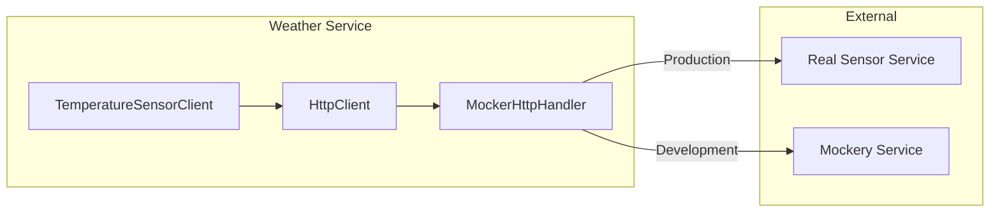

### Typed Client Implementation

Sensor clients are **clean typed HTTP clients** that return **sensor models** (not Weather models):

```csharp
public class TemperatureSensorClient : ITemperatureSensorClient
{
    private readonly HttpClient _httpClient;
    
    public TemperatureSensorClient(HttpClient httpClient)
    {
        _httpClient = httpClient;
    }
    
    public async Task<SensorTemperatureResponse> GetTemperatureAsync()
    {
        // Calls the real sensor URL - MockerHttpHandler redirects to Mockery in dev
        return await _httpClient.GetFromJsonAsync<SensorTemperatureResponse>("/api/temperature")
            ?? throw new InvalidOperationException("Failed to deserialize temperature response");
    }
}

public class WindSensorClient : IWindSensorClient
{
    private readonly HttpClient _httpClient;
    
    public WindSensorClient(HttpClient httpClient)
    {
        _httpClient = httpClient;
    }
    
    public async Task<SensorWindResponse> GetWindAsync()
    {
        return await _httpClient.GetFromJsonAsync<SensorWindResponse>("/api/wind")
            ?? throw new InvalidOperationException("Failed to deserialize wind response");
    }
}

public class PrecipitationSensorClient : IPrecipitationSensorClient
{
    private readonly HttpClient _httpClient;
    
    public PrecipitationSensorClient(HttpClient httpClient)
    {
        _httpClient = httpClient;
    }
    
    public async Task<SensorPrecipitationResponse> GetPrecipitationAsync()
    {
        return await _httpClient.GetFromJsonAsync<SensorPrecipitationResponse>("/api/precipitation")
            ?? throw new InvalidOperationException("Failed to deserialize precipitation response");
    }
}
```

### Dependency Injection Registration

```csharp
// Program.cs
builder.Services.AddTransient<MockerHttpHandler>();

// Register typed clients with MockerHttpHandler
builder.Services.AddHttpClient<ITemperatureSensorClient, TemperatureSensorClient>(client =>
{
    client.BaseAddress = new Uri(builder.Configuration["SensorServices:Temperature:BaseUrl"]!);
})
.AddHttpMessageHandler<MockerHttpHandler>();

builder.Services.AddHttpClient<IWindSensorClient, WindSensorClient>(client =>
{
    client.BaseAddress = new Uri(builder.Configuration["SensorServices:Wind:BaseUrl"]!);
})
.AddHttpMessageHandler<MockerHttpHandler>();

builder.Services.AddHttpClient<IPrecipitationSensorClient, PrecipitationSensorClient>(client =>
{
    client.BaseAddress = new Uri(builder.Configuration["SensorServices:Precipitation:BaseUrl"]!);
})
.AddHttpMessageHandler<MockerHttpHandler>();
```

### Configuration

**appsettings.json:**
```json
{
    "SensorServices": {
        "Temperature": {
            "BaseUrl": "https://temperature-sensor.example.com"
        },
        "Wind": {
            "BaseUrl": "https://wind-sensor.example.com"
        },
        "Precipitation": {
            "BaseUrl": "https://precipitation-sensor.example.com"
        }
    },
    "Mockery": {
        "Enabled": true,
        "BaseUrl": "http://localhost:8080",
        "MockIdPrefix": "Sensors"
    }
}
```

**appsettings.Development.json:**
```json
{
    "Mockery": {
        "Enabled": true
    }
}
```

**appsettings.Production.json:**
```json
{
    "Mockery": {
        "Enabled": false
    }
}
```

### Mock File Structure

```
mocks/
└── Sensors/
    ├── temperature.json
    ├── wind.json
    └── precipitation.json
```

### Mock File Contents

Mock files use **sensor model format** (not Weather API format):

**Sensors/temperature.json:**
```json
{
    "temp": 72.5,
    "tempUnit": "F",
    "apparentTemp": 74.0,
    "readingTime": "2025-12-14T15:30:00Z"
}
```

**Sensors/wind.json:**
```json
{
    "windSpeed": 12.3,
    "speedUnit": "mph",
    "windDirection": 315,
    "gustSpeed": 18.5,
    "readingTime": "2025-12-14T15:30:00Z"
}
```

**Sensors/precipitation.json:**
```json
{
    "precipAmount": 0.0,
    "precipUnit": "in",
    "precipType": "none",
    "relativeHumidity": 45,
    "readingTime": "2025-12-14T15:30:00Z"
}
```

---

## 9. OpenTelemetry Integration

### Overview

The Weather service integrates with OpenTelemetry for comprehensive observability including distributed tracing, metrics, and structured logging.

### NuGet Packages

```xml
<PackageReference Include="OpenTelemetry.Extensions.Hosting" Version="1.10.0" />
<PackageReference Include="OpenTelemetry.Instrumentation.AspNetCore" Version="1.10.1" />
<PackageReference Include="OpenTelemetry.Instrumentation.Http" Version="1.10.0" />
<PackageReference Include="OpenTelemetry.Exporter.OpenTelemetryProtocol" Version="1.10.0" />
```

### Observability Architecture

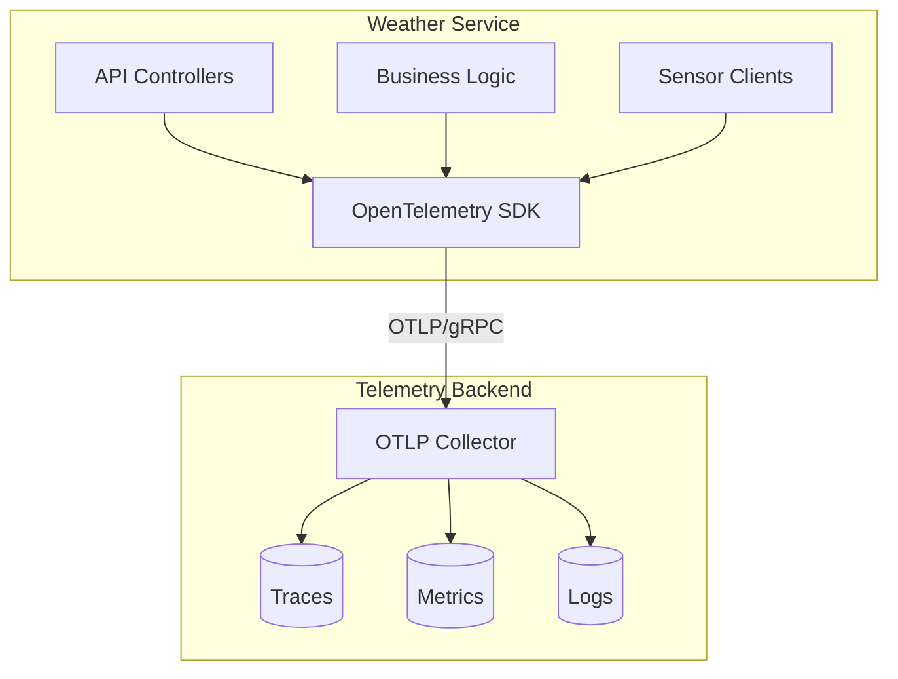

### Configuration

```csharp
// Program.cs
builder.Services.AddOpenTelemetry()
    .ConfigureResource(resource => resource
        .AddService(
            serviceName: "Weather",
            serviceVersion: typeof(Program).Assembly.GetName().Version?.ToString() ?? "1.0.0"))
    .WithTracing(tracing => tracing
        .AddAspNetCoreInstrumentation()
        .AddHttpClientInstrumentation()
        .AddOtlpExporter())
    .WithMetrics(metrics => metrics
        .AddAspNetCoreInstrumentation()
        .AddHttpClientInstrumentation()
        .AddOtlpExporter())
    .WithLogging(logging => logging
        .AddOtlpExporter());
```

### Environment Variables

| Variable | Description | Example |
|----------|-------------|---------|
| `OTEL_SERVICE_NAME` | Service identifier | `Weather` |
| `OTEL_EXPORTER_OTLP_ENDPOINT` | Telemetry endpoint URL | `http://localhost:4317` |
| `OTEL_EXPORTER_OTLP_PROTOCOL` | Export protocol | `grpc` |

### Trace Flow

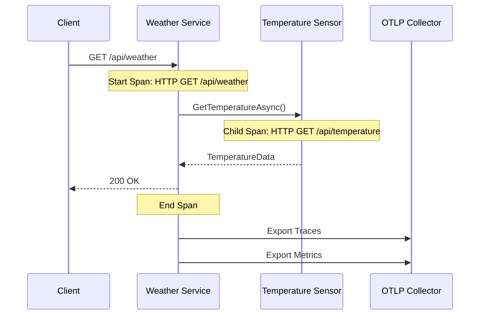

### Custom Spans (Optional)

```csharp
public class WeatherBusinessLogic : IWeatherBusinessLogic
{
    private static readonly ActivitySource ActivitySource = new("Weather.BusinessLogic");
    
    public async Task<WeatherData> GetCurrentWeatherAsync()
    {
        using var activity = ActivitySource.StartActivity("GetCurrentWeather");
        activity?.SetTag("weather.operation", "aggregate");
        
        // Parallel sensor calls...
        
        activity?.SetTag("weather.sensors.count", 3);
        return weatherData;
    }
}
```

### Metrics Collected

| Metric | Type | Description |
|--------|------|-------------|
| `http.server.request.duration` | Histogram | API request latency |
| `http.client.request.duration` | Histogram | Sensor client latency |
| `http.server.active_requests` | UpDownCounter | Active request count |

---

## 10. Security Considerations

| Area | Consideration | Approach |
|------|---------------|----------|
| Input Validation | API inputs are minimal (no user input) | N/A for GET-only endpoints |
| Secrets | Mockery URL configuration | Environment variables / appsettings |
| Transport | HTTPS for production | Configure Kestrel/reverse proxy |
| Error Handling | Don't expose internal errors | Use generic error responses |

---

## 11. Testing Strategy

### Unit Tests (xUnit + Moq + FluentAssertions)

| Component | Test Focus |
|-----------|------------|
| WeatherBusinessLogic | Aggregates data from all sensors correctly |
| TemperatureBusinessLogic | Returns sensor data, handles errors |
| WindBusinessLogic | Returns sensor data, handles errors |
| PrecipitationBusinessLogic | Returns sensor data, handles errors |

### Integration Tests

| Test | Description |
|------|-------------|
| API Endpoint Tests | Verify HTTP status codes and response format |
| Mockery Integration | End-to-end test with Mockery service |

### Test Pattern

```csharp
public class WeatherBusinessLogicTests
{
    private readonly Mock<ITemperatureSensorClient> _tempClientMock;
    private readonly Mock<IWindSensorClient> _windClientMock;
    private readonly Mock<IPrecipitationSensorClient> _precipClientMock;
    private readonly WeatherBusinessLogic _sut;
    
    public WeatherBusinessLogicTests()
    {
        _tempClientMock = new Mock<ITemperatureSensorClient>();
        _windClientMock = new Mock<IWindSensorClient>();
        _precipClientMock = new Mock<IPrecipitationSensorClient>();
        
        _sut = new WeatherBusinessLogic(
            _tempClientMock.Object,
            _windClientMock.Object,
            _precipClientMock.Object);
    }
    
    [Fact]
    public async Task GetCurrentWeatherAsync_AggregatesAllSensorData()
    {
        // Arrange
        _tempClientMock.Setup(x => x.GetTemperatureAsync())
            .ReturnsAsync(new TemperatureData { Value = 72.5m });
        // ... setup other mocks
        
        // Act
        var result = await _sut.GetCurrentWeatherAsync();
        
        // Assert
        result.Temperature.Value.Should().Be(72.5m);
    }
}
```

---

## 12. Risks & Mitigations

| Risk | Impact | Likelihood | Mitigation |
|------|--------|------------|------------|
| Mockery service unavailable | High | Medium | Implement retry logic with Polly |
| Slow sensor responses | Medium | Medium | Use parallel calls with timeout |
| Invalid mock data format | Medium | Low | Validate response schema, log errors |
| Network connectivity issues | High | Low | Health checks, circuit breaker pattern |

---

## 13. Alternatives Considered

### Alternative 1: Direct Mock Data in Code
- **Description**: Hardcode mock responses in the Weather service
- **Pros**: Simpler, no external dependency
- **Cons**: Can't easily change mock data without redeployment
- **Decision**: Rejected - Mockery provides more flexibility

### Alternative 2: In-Memory Fake Services
- **Description**: Create fake implementations of sensor interfaces
- **Pros**: No network calls, faster tests
- **Cons**: Doesn't test HTTP client code paths
- **Decision**: Use for unit tests, Mockery for integration tests

---

## Project Structure

```
Weather/
├── src/
│   └── Weather/
│       ├── Controllers/
│       │   └── WeatherController.cs             # All weather endpoints
│       ├── BusinessLogic/
│       │   ├── IWeatherBusinessLogic.cs         # Interface with all methods
│       │   └── WeatherBusinessLogic.cs          # Implementation with all methods
│       ├── Clients/
│       │   ├── Models/                          # Sensor models (internal)
│       │   │   ├── SensorTemperatureResponse.cs
│       │   │   ├── SensorWindResponse.cs
│       │   │   └── SensorPrecipitationResponse.cs
│       │   ├── Handlers/
│       │   │   ├── MockeryHandler.cs            # DelegatingHandler for Mockery
│       │   │   └── MockeryHandlerOptions.cs     # Configuration options
│       │   ├── ITemperatureSensorClient.cs
│       │   ├── TemperatureSensorClient.cs
│       │   ├── IWindSensorClient.cs
│       │   ├── WindSensorClient.cs
│       │   ├── IPrecipitationSensorClient.cs
│       │   └── PrecipitationSensorClient.cs
│       ├── Models/                              # Weather API models (public)
│       │   ├── WeatherData.cs
│       │   ├── TemperatureData.cs
│       │   ├── WindData.cs
│       │   └── PrecipitationData.cs
│       ├── Program.cs
│       └── appsettings.json
├── tests/
│   └── Weather.Tests/
│       └── BusinessLogic/
│           └── WeatherBusinessLogicTests.cs     # All business logic tests
└── mocks/
    └── Sensors/
        ├── temperature.json
        ├── wind.json
        └── precipitation.json
